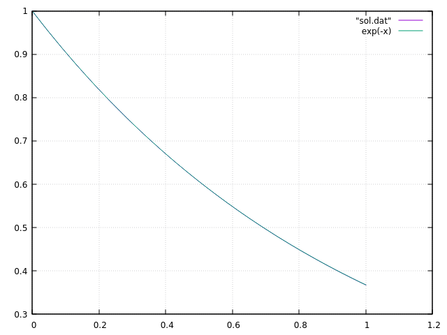

## 方程式

$$
\begin{align*}
\frac{dx(t)}{dt} = -x
\end{align*}
$$

## 解

$$
\begin{align*}
x(t) = x(0) e^{-t}
\end{align*}
$$

## 数値計算

陽的なオイラー法．

十分に小さい $h$ に対して，以下の離散化で近似解が得られることが期待される．

$$
\begin{align*}
\frac{dx}{dt} \approx \frac{x(t + h) - x(t)}{h} = -x(t)
\end{align*}
$$

この離散化された式は以下のように書くことが多い．

$$
\begin{align*}
x_{n+1} = x_{n} - h x_{n}
\end{align*}
$$

少し変形すると以下の通りになる．

$$
\begin{align*}
x_{n+1} = (1 - h) x_{n} = (1 - h)^{n}
\end{align*}
$$

ここで $x_n$ は $x(nh)$ の近似値である．

今 $nh = 1$ となるように計算したので， $x(-1) = e^{-1}$ となる． $h = \frac{1}{1000}$， $n = 1000$ として計算しので，以下を計算していることになる．

$$
\begin{align*}
x(1) \approx x_{1000} = \left(1 - \frac{1}{1000}\right)^{1000} = 0.36769542477096373\ (数値計算の結果)
\end{align*}
$$

指数関数の定義を思い出す．

$$
\begin{align*}
e^{x} = \lim_{n \to \infty} \left( 1 + \frac{x}{n} \right)^{n}
\end{align*}
$$

確かに数値計算の結果は厳密解である $x(1) = e^{-1}$ を計算していることになっている．

### 問題

離散化を以下のようにすると精度はどのようになるか．

$$
\begin{align*}
\frac{dx}{dt} \approx \frac{x(t + h) - x(t-h)}{2h}
\end{align*}
$$

1ステップ目は陽的なオイラー法を使って計算してその後は上の式を使って計算するとどのような結果になるか．安定性はどうか．

## 可視化方法

適当な名前のファイルに出力する．

```
$ cargo run --release > sol.dat
```

gnuplotで可視化する．

```
$ gnuplot
gnuplot> plot "sol.dat" w l
gnuplot> replot exp(-x)
```

## 可視化結果


